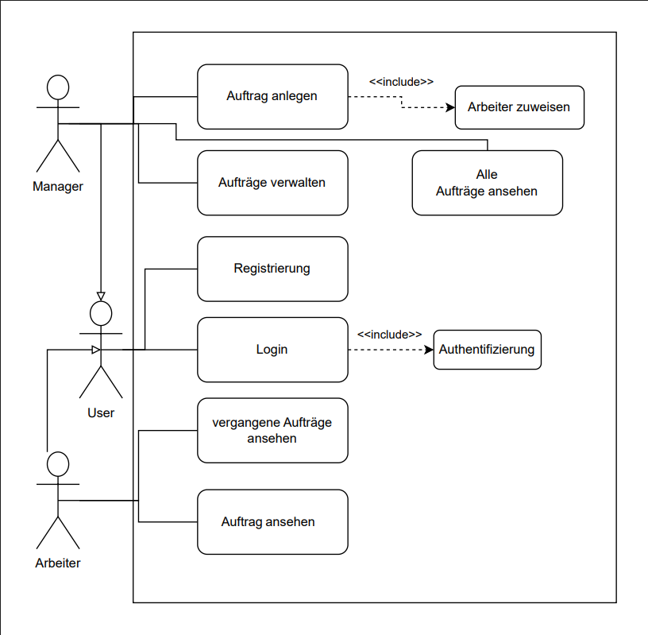
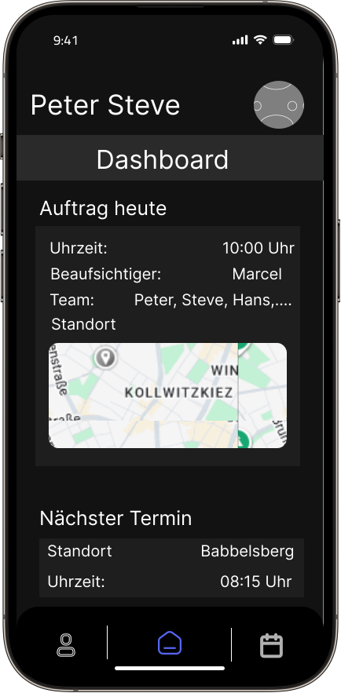
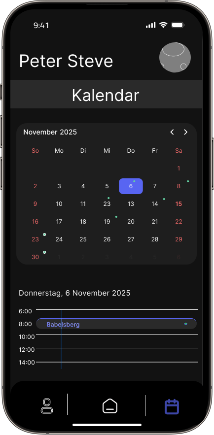
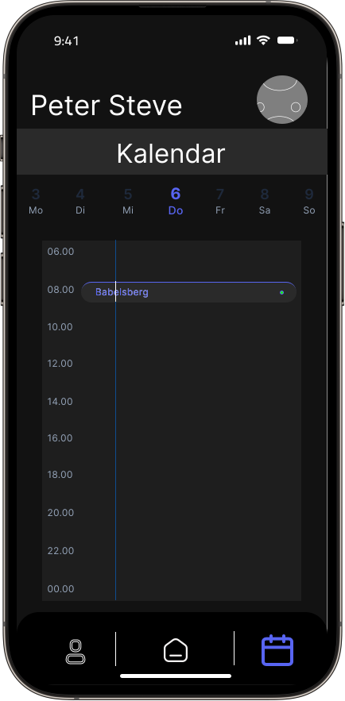
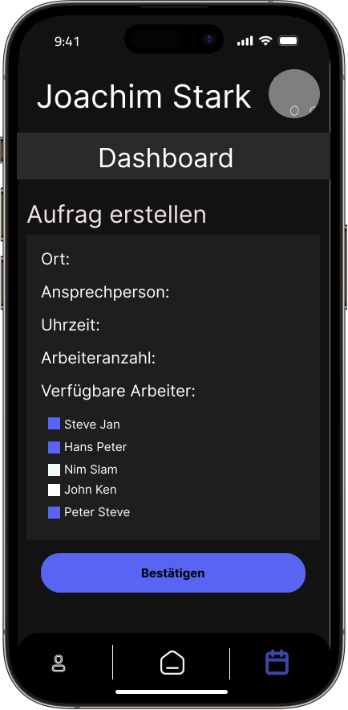

# Mage – Mobile Management für Projekteinsätze

## Projektkonzept – Enterprise Web Development

**Einzelprojekt von Mohammad Hammad, 929184**  
**Betreuer:** Prof. Dr. Sebastian von Klinski  
**Hochschule:** Berliner Hochschule für Technik

---

## 1. Einleitung

Dieses Dokument beschreibt das Projektkonzept für die Anwendung Mage, entwickelt im Rahmen der Lehrveranstaltung Enterprise Web Development.  
Das Ziel des Projekts ist die Konzeption und prototypische Umsetzung einer mobilen Anwendung mit zugehöriger REST-API zur Verwaltung und Koordination von Mitarbeiteraufträgen.

Da es sich um ein Einzelprojekt handelt, umfasst der Umsetzungsumfang die Entwicklung eines eigenständigen REST-Backends auf Basis von Spring Boot sowie einer mobilen React Native App als Frontend, die über HTTP mit der API kommuniziert.

---

## 2. Projektidee und Motivation

In projektorientierten Branchen wie Filmproduktion, Eventplanung oder Bühnenbau ist die kurzfristige und effiziente Organisation von Mitarbeitenden entscheidend. Manager müssen Aufträge planen, Personal koordinieren und auf Änderungen flexibel reagieren können, oft von unterwegs.

Die mobile Anwendung Mage soll diesen Prozess vereinfachen, indem sie die Planung, Zuweisung und Nachverfolgung von Arbeitsaufträgen zentralisiert. So können Manager ihre Teams jederzeit im Blick behalten, während Mitarbeitende transparent über ihre Aufträge informiert werden.

---

## 3. Zielgruppe

Mage richtet sich an Manager und Mitarbeitende in projektbasierten Arbeitsumgebungen, in denen wechselnde Einsatzorte und flexible Zeitplanung zum Alltag gehören.

Manager sind für Auftragsplanung und Personaldisposition verantwortlich und arbeiten häufig mit mehreren parallelen Projekten.  
Mitarbeitende sind projektbezogen tätig und benötigen klare Informationen zu Zeit, Ort und Aufgaben.

Für Manager bietet die Anwendung einen Überblick über Personalverfügbarkeit, Aufträge und Arbeitszeiten. Mitarbeitende profitieren von klaren Auftragsinformationen und der Möglichkeit, ihre Arbeitszeiten direkt in der App zu erfassen.

---

## 4. Anforderungen

### Funktionale Anforderungen

Mage bietet eine REST-API zur Verwaltung von Nutzern, Aufträgen und Zuweisungen. Alle zentralen Entitäten können über CRUD-Operationen bearbeitet werden.  
Die App ermöglicht eine Benutzerregistrierung mit Login, ein einfaches Rollenmanagement für Manager und Mitarbeitende sowie den mobilen Zugriff auf die API.

#### Manager

- können neue Aufträge anlegen, bearbeiten und löschen
- weisen **Arbeiter** bestimmten Aufträgen zu
- verwalten Einsatzorte, Einsatzzeiten und den Auftragsstatus
- sehen geleistete Stunden ihrer Mitarbeitenden ein

#### Arbeiter (Mitarbeitende)

- sehen ihre **zugewiesenen Aufträge** in einer klar strukturierten Übersicht oder Kalenderansicht
- können **Arbeitszeiten erfassen** und den Status ihres Auftrags (z. B. „abgeschlossen“) übermitteln

### Erweiterte Anforderungen

Mage soll eine Kalenderansicht für geplante Aufträge enthalten, optional Benachrichtigungen bei Änderungen ermöglichen und eine E-Mail-Verifizierung bei der Registrierung unterstützen.  
Weitere sinnvolle Erweiterungen sind die Erfassung von geleisteten Stunden sowie detailliertere Mitarbeiterprofile mit Qualifikationen und Verfügbarkeiten.

### Nicht-funktionale Anforderungen

Die Anwendung ist plattformunabhängig und läuft auf Android und iOS.  
Sie basiert auf einer skalierbaren Architektur mit REST-API und relationaler Datenbank.  
Das Benutzerinterface wird bewusst einfach und intuitiv gestaltet, um eine reibungslose Nutzung zu gewährleisten.

---

## 5. Use-Case / User Story

Die zentralen Anwendungsfälle von Mage sind das Anlegen neuer Aufträge, das Zuweisen von Mitarbeitenden, die Erfassung von Arbeitszeiten sowie die Anzeige laufender und abgeschlossener Aufträge.  
Diese Prozesse bilden den Kern der täglichen Nutzung durch Manager und Mitarbeitende.

### Typisches Szenario

Ein Manager erhält kurzfristig einen Anruf mit der Bitte, ein Team für einen Filmdreh in Babelsberg zu organisieren.  
Er öffnet die Mage-App, legt einen **neuen Auftrag** an, trägt **Ort**, **Datum**, **Uhrzeit** und **Ansprechpartner** ein und weist fünf verfügbare Mitarbeitende zu.  
Alle erhalten automatisch eine Benachrichtigung über den neuen Auftrag (optional).

Nach Abschluss des Drehs erfassen die Mitarbeitenden ihre geleisteten Stunden direkt in der App.  
Der Manager kann diese anschließend einsehen und prüfen.

### User Story

> Als Manager möchte ich flexibel neue Aufträge planen, mein Team effizient besetzen und sicherstellen, dass alle Mitarbeitenden rechtzeitig informiert werden, um Projekte optimal zu koordinieren.

> Als Mitarbeitender möchte ich eine strukturierte Übersicht über meine Aufträge und meine im aktuellen Monat geleisteten Stunden erhalten, um meine Arbeit besser planen und nachvollziehen zu können.

### Use Case

---

## 6. Softwarearchitektur

Mage folgt einer klassischen Client-Server-Architektur mit klarer Trennung zwischen Frontend, Backend und Datenhaltung.  
Zusätzlich werden Build- und Routing-Komponenten eingesetzt, um Entwicklung und Wartung zu vereinfachen.

| Ebene                 | Technologie  | Beschreibung                                                            | Logo                                                                                                                                         |
| --------------------- | ------------ | ----------------------------------------------------------------------- | -------------------------------------------------------------------------------------------------------------------------------------------- |
| **Frontend**          | React Native | Mobile App für iOS und Android                                          |                                                    |
| **Backend**           | Spring Boot  | REST-API und Geschäftslogik                                             |                                    |
| **Routing (API)**     | Express.js   | Routing-Logik für API-Endpunkte (optional bei Microservices oder Proxy) |                                                     |
| **Datenbank**         | PostgreSQL   | Relationale Datenbank für persistente Speicherung                       |                                           |
| **Package Manager**   | Maven        | Verwaltung von Abhängigkeiten und Build-Prozessen für das Backend       |  |
| **API-Kommunikation** | REST / JSON  | Datenaustausch zwischen Frontend und Backend                            |                                                                                      |

**Beschreibung:**

- Das **Frontend** nutzt _React Native_ für die plattformübergreifende App-Entwicklung.
- Das **Backend** ist mit _Spring Boot_ umgesetzt und stellt eine REST-API bereit.
- Für **Routing und Middleware** wird optional _Express.js_ genutzt, falls der API-Zugriff über Node.js gesteuert oder erweitert wird (z. B. bei Microservices).
- Die **Datenhaltung** erfolgt in einer _PostgreSQL_-Datenbank, angebunden über _Spring Data JPA_ und _Hibernate_.
- Das **Build- und Abhängigkeitsmanagement** übernimmt _Maven_.
- Die **Kommunikation** zwischen Frontend und Backend erfolgt über JSON-basierte REST-Endpunkte.

---

## 7. Datenmodell

Das Datenmodell besteht aus den Entitäten **User**, **Manager**, **Employee**, **Job**, **Assignment** und optional **Notification**.

User ist die abstrakte Oberklasse für alle Nutzer.  
Manager erbt von User und erstellt Aufträge.  
Employee enthält Informationen wie Stundenlohn und Verfügbarkeit und kann mehreren Aufträgen zugewiesen sein.  
Jobs werden von Managern erstellt und enthalten Informationen zu Ort, Zeit, Kontaktperson und Notizen.  
Assignments verbinden Mitarbeitende mit Aufträgen und enthalten Statusinformationen und geleistete Stunden.  
Optional können Notifications Nachrichten an Mitarbeitende darstellen.

---

## 8. REST-API

Die REST-API ermöglicht den Zugriff auf Mitarbeitende, Aufträge und Zuweisungen.  
Sie bietet Endpunkte zum Erstellen, Bearbeiten, Löschen und Abrufen der entsprechenden Daten.  
Die Kommunikation erfolgt über HTTP mit JSON-Nachrichten und ist so gestaltet, dass sie leicht in andere Systeme integriert werden kann.

**Beispiel-Endpunkte:**

- `GET /api/jobs` – Liste aller Aufträge
- `POST /api/jobs` – Neuen Auftrag erstellen
- `GET /api/employees/{id}/assignments` – Aufträge eines Mitarbeiters abrufen

---

## 9. Frontend- und Designkonzept

Die mobile App stellt unterschiedliche Ansichten bereit, je nach Nutzerrolle.  
Manager sehen eine Auftragsübersicht mit Bearbeitungsfunktionen, Mitarbeitende ihren persönlichen Kalender mit zugewiesenen Aufträgen.

Zu den zentralen Ansichten gehören Login und Registrierung, das Dashboard für Manager, Auftragsdetails mit Teamübersicht, eine Mitarbeitendenliste, die Kalenderansicht für Mitarbeitende und ein Bereich für Benachrichtigungen.

---

### Mockups

Die folgenden Mockups zeigen exemplarisch das visuelle Design und die Benutzerführung der App:

#### **Arbeiter-Dashboard**

#### **Manager-Dashboard** beim erstellen eines Jobs und zuweisen der Arbeiter

---

## 10. Zeitplan und Meilensteine

- In der ersten Woche wird das Projektkonzept finalisiert und das Datenmodell entworfen.
- In der zweiten Woche wird das Spring-Boot-Backend aufgesetzt und die REST-API entwickelt.
- In der dritten Woche erfolgt das Testen des Backends.
- In der vierten Woche wird die Grundstruktur der React-Native-App umgesetzt.
- In der fünften Woche wird die Verbindung zwischen Frontend und Backend hergestellt.
- In der sechsten Woche erfolgen Benachrichtigungsfunktionen, abschließende Tests und die Dokumentation.

---

## 11. Fazit

Mage bietet eine moderne Lösung für die Personal- und Auftragsplanung in dynamischen Branchen.  
Der Fokus liegt auf Mobilität, Benutzerfreundlichkeit und Effizienz.  
Durch die gewählten Technologien entsteht eine skalierbare und zukunftsfähige Architektur, die leicht erweitert werden kann und sowohl für Manager als auch Mitarbeitende einen klaren Mehrwert bietet.

---

## 12. Quellen / Hilfestellung

ChatGPT 5 hat mir geholfen, Formulierungen zu präzisieren und Rechtschreibfehler zu korrigieren.  
Die Szenarien sind echt und kommen aus einer Firma namens Talat Helping Hands.

Die Resourcen von Figma sind :

- https://www.figma.com/design/mfbxsavpW1BDCewFTUTKc9/Iconicool-%7C-Free-Iconset--Community-?node-id=1502-58&t=2s98RHSZZ80VIuPr-0
- https://www.figma.com/design/Fx5KGmiBT1eGpBp8qJOFpp/-3D-Mockups--iPhone12pro--Community-?node-id=110-270&p=f&t=6qhlA2QkqUoLEcXX-0
- https://www.figma.com/design/4OjvCmg2VzGwnYM0A6OAhy/Calendar-mobile-app--Community-?node-id=1-2&t=DVP2Hj7BYFPlbcWY-0
- https://www.figma.com/design/xCTUKiCnZX3gr3WsNG3cs7/Calendar-UI--Community-?node-id=1-2&t=qWZDADdrjhK6XfNG-0
